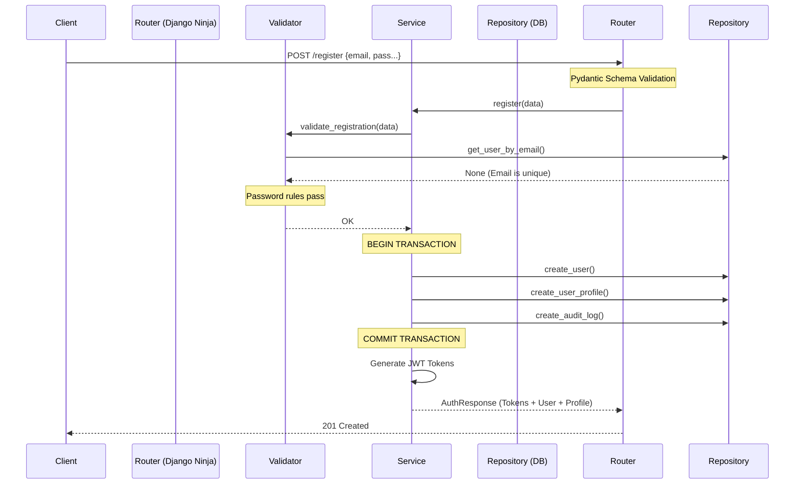

# Register API

This document explains the flow when a user creates a new account via `POST /api/auth/register`.

## Request Lifecycle
1. **Client Sends Request:** The frontend sends a JSON payload containing `email`, `password`, `password_confirm`, `first_name`, and `last_name`.
2. **Schema Validation:** Django Ninja intercepts the request. The `RegisterRequest` schema (Pydantic) checks that the email is valid and passwords meet length constraints. If invalid, it immediately returns a 422 Unprocessable Entity.
3. **Business Validation:** The `service.register` function takes over. It calls `validators.validate_registration`:
   - Checks if the email already exists in the database (`ConflictError`).
   - Checks if `password == password_confirm` (`ValidationError`).
   - Checks if the password has uppercase, lowercase, numbers, and special characters (`ValidationError`).
4. **Database Transaction Begins:** `with transaction.atomic():` ensures that if any database query fails, ALL of them are rolled back. We don't want a `User` created without a `UserProfile`!
5. **Create User:** The repository calls `User.objects.create_user`, which hashes the password using Argon2 and saves the user.
6. **Create Profile:** The repository creates the linked `UserProfile`.
7. **Audit Log:** The repository records a `"REGISTER"` action with the user's IP and User-Agent.
8. **Generate Tokens:** `jwt.create_token_pair` issues an access and refresh token.
9. **Return Response:** The `AuthResponse` schema serializes the user, profile, and tokens into a clean JSON response (201 Created).

## Sequence Diagram

