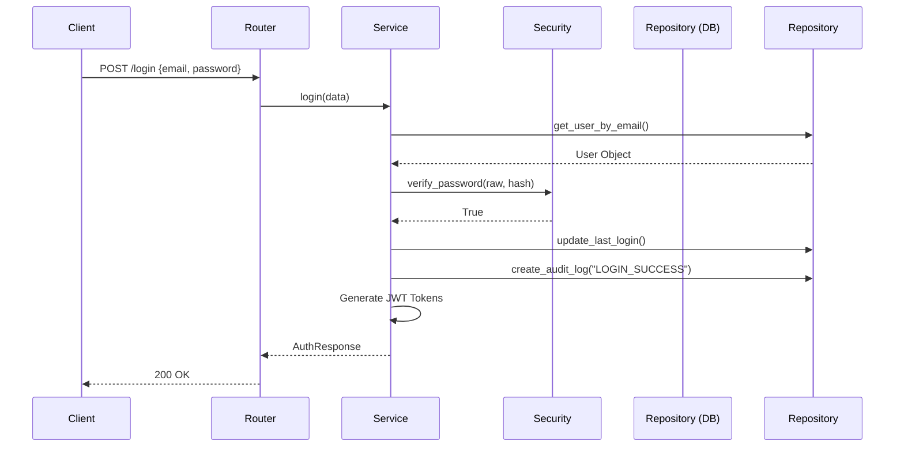

# Login API

This document explains the flow when an existing user logs in via `POST /api/auth/login`.

## Request Lifecycle
1. **Client Sends Request:** The frontend sends `email` and `password`.
2. **Schema Validation:** Django Ninja verifies the payload matches `LoginRequest`.
3. **Fetch User:** `service.login` asks the repository for the user by email.
4. **Credential Verification:**
   - If the user doesn't exist, we raise `AuthenticationError("Invalid email or password.")`.
   - If the user exists, we use `verify_password()` (Argon2 check). If it fails, we raise the *exact same error message*. (This prevents attackers from knowing which emails exist).
5. **Account Status Check:** If `user.is_active` is False, we raise an error.
6. **Update Metadata:** `repository.update_last_login(user)` sets `last_login` to `timezone.now()`.
7. **Audit Log:** We record a `"LOGIN_SUCCESS"` event.
8. **Generate Tokens:** `create_token_pair(user)` creates fresh JWTs.
9. **Return Response:** Serialized via `AuthResponse`.

## Sequence Diagram

